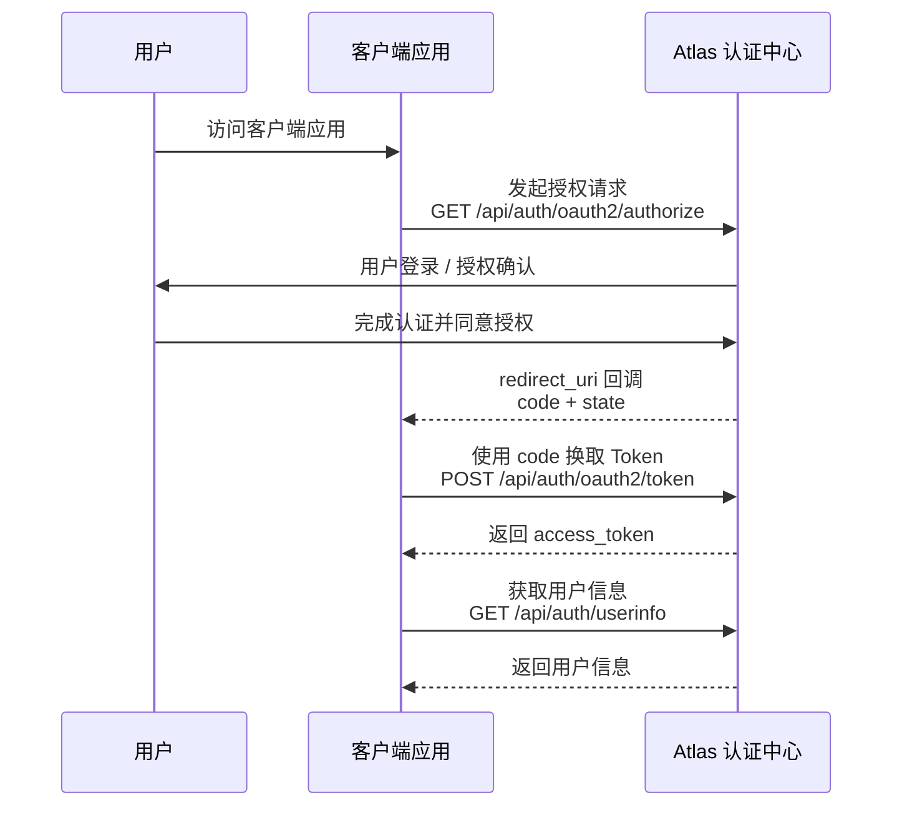

# 授权码模式 (Authorization Code)

授权码模式是 OAuth 2.0 中最安全、最常用的认证授权模式，适用于拥有后端服务器的应用（如 Web 应用或服务端的移动应用代理）。

## 授权流程概览

授权码模式整体流程如下：



---

## 1. 获取授权码

### 1.1. 接口请求信息

* **请求地址**: `/api/auth/oauth2/authorize`
* **请求方式**: `GET`
* **接口说明**: 引导客户端发起授权请求。系统会校验当前用户的登录状态与请求参数。

---

### 1.2. 请求头 (Headers)

| 参数名 | 类型 | 必填 | 说明 |
| :--- | :--- | :--- | :--- |
| `Authorization` | string | 否 | **用户会话凭证**。格式为 `Bearer <Access Token>`。 |

> **💡 登录状态说明**：
> * 如果请求时**未携带** `Authorization` 请求头，或者携带的 Token 已失效/不存在，系统会自动拦截并**重定向至登录页**，引导用户完成身份认证。
> * 用户登录成功后，将自动携带该 Token 重新回到授权流程。

---

### 1.3. 请求参数 (Query Parameters)

| 参数名 | 类型 | 必填 | 说明 |
| :--- | :--- | :--- | :--- |
| `client_id` | string | 是 | 客户端唯一标识（由 Atlas 开放平台分配）。 |
| `response_type` | string | 是 | 响应类型。授权码模式下固定为 **`code`**。 |
| `scope` | string | 是 | 权限范围。多个权限之间使用空格分隔（也支持 `+` 编码形式）。不同 scope 决定客户端可访问的资源范围。详细说明请参考 [Scope 权限范围说明](/docs/oauth2/concepts/scope)。 |
| `redirect_uri` | string | 是 | 授权成功后的回调地址。必须与应用注册时登记的白名单地址一致（需进行 URL 编码）。 |
| `state` | string | 否 | 客户端生成并维护的随机状态值。Atlas 会在授权完成后的回调请求中原样返回该参数，客户端应校验返回值是否与发起授权请求时一致，用于防止 CSRF（跨站请求伪造）攻击。**强烈推荐传入。** |
| `prompt` | string | 否 | 交互提示策略。例如设置为 `consent` 时，会强制弹出授权确认页，要求用户手动确认授权。 |
| `code_challenge` | string | 否 | PKCE 参数。客户端生成随机 `code_verifier` 后，通过指定算法计算得到的挑战值。授权成功后，服务端会基于该值绑定授权码，防止授权码被截获后被恶意兑换。**强烈推荐传入。** |
| `code_challenge_method` | string | 否 | PKCE 挑战值计算方式。推荐使用 **`S256`**，表示使用 SHA-256 算法计算 `code_challenge`。**强烈推荐传入** |

> **🔐 PKCE 安全要求**
>
> Atlas 强烈建议所有客户端接入授权码模式时启用 PKCE（Proof Key for Code Exchange）。
>
> PKCE 详细机制、参数说明以及 Token 兑换流程请参考：
>
> [PKCE 安全机制说明](/docs/oauth2/concepts/pkce)

---

### 1.4. 调试示例 (cURL)

```bash
curl --location --request GET 'https://atlas.sample.xx/api/auth/oauth2/authorize' \
  --header 'Authorization: Bearer xxx' \
  --data-urlencode 'client_id=xxxx' \
  --data-urlencode 'response_type=code' \
  --data-urlencode 'scope=profile openid' \
  --data-urlencode 'redirect_uri=https://client.sample.xx/oauth2/callback/atlas' \
  --data-urlencode 'state=xxxx' \
  --data-urlencode 'prompt=consent' \
  --data-urlencode 'code_challenge=xxxxxxxxxxxxxxxx' \
  --data-urlencode 'code_challenge_method=S256'
```

---

### 1.5 响应说明

授权接口不会直接返回 Access Token，而是通过浏览器重定向（HTTP 302 Redirect）的方式完成授权流程。

根据用户登录状态、授权策略以及用户操作结果，可能存在以下几种响应情况。

---

#### 1.5.1 跳转登录页

当请求未携带有效的用户登录凭证时：

- 未携带 `Authorization` 请求头
- Token 已过期
- Token 不存在或无效

系统会将用户重定向至登录页面。

用户完成登录后，系统会自动恢复原授权流程。

---

#### 1.5.2 跳转授权确认页

当请求参数中指定：

```text
prompt=consent
```

系统会跳转至授权确认页面。

用户需要在授权页面确认是否允许客户端访问申请的权限。

授权页面通常包含：

- 应用名称
- 应用描述
- 请求授权的权限范围（scope）
- 用户确认 / 拒绝操作

---

#### 1.5.3 授权成功响应

用户确认授权后，系统会将浏览器重定向至客户端注册的 `redirect_uri`，并携带授权码。

响应示例：

```http
HTTP/1.1 302 Found
Location: https://client.sample.xx/oauth2/callback/atlas?code=xxxxxx&state=xxxx
```

客户端收到的回调地址：

```text
https://client.sample.xx/oauth2/callback/atlas?code=xxxxxx&state=xxxx
```

回调参数说明：

| 参数名 | 类型 | 必填 | 说明 |
| :--- | :--- | :- | :--- |
| `code` | string | 是 | 授权码，用于后续调用 Token 接口兑换 Access Token。授权码具有有效期限制，并且只能使用一次。 |
| `state` | string | 否 | 原样返回客户端请求中的状态值，用于客户端校验请求合法性，防止 CSRF 攻击。 |

> 注意：
>
> - 客户端收到 `code` 后，应立即调用 Token 接口完成兑换。
> - `code` 只能使用一次，兑换成功后立即失效。
> - 客户端必须校验返回的 `state` 是否与发起授权请求时一致。

---

#### 1.5.4 用户拒绝授权

如果用户在授权确认页面点击拒绝，系统不会返回授权码，而是重定向至客户端 `redirect_uri`，并携带错误信息。

响应示例：

```http
HTTP/1.1 302 Found
Location: https://client.sample.xx/oauth2/callback/atlas?error=access_denied&state=xxxx
```

回调参数说明：

| 参数名 | 类型 | 必填 | 说明 |
| :--- | :--- | :- | :--- |
| `error` | string | 是 | OAuth2 错误码，例如 `access_denied`。 |
| `state` | string | 否 | 原请求携带的状态值。 |

---

#### 1.5.5 授权请求失败

当请求参数校验失败时，例如：

- `client_id` 不存在
- `redirect_uri` 未注册或不匹配
- `scope` 不支持
- 缺少必填参数

系统会直接返回错误响应。

响应示例：

```json
{
  "error": "invalid_request",
  "error_description": "Missing required parameter: client_id"
}
```

错误码说明：

| 错误码 | 说明 |
| :--- | :--- |
| `invalid_request` | 请求参数缺失或格式错误。 |
| `invalid_client` | 客户端身份校验失败。 |
| `invalid_redirect_uri` | 回调地址未注册或不匹配。 |
| `invalid_scope` | 请求权限范围不存在或不支持。 |
| `access_denied` | 用户拒绝授权。 |


---

## 2. 获取 Access Token

客户端获取授权码（`code`）后，需要调用 Token 接口兑换 Access Token。

Token 接口用于完成 OAuth2 授权码交换流程。

客户端需要携带：

- 授权阶段获取的 `code`
- 客户端身份信息
- 原始授权请求中的 `redirect_uri`
- PKCE 流程生成的 `code_verifier`（如果启用了 PKCE）

Atlas 认证中心会校验授权码有效性、客户端信息以及 PKCE 参数，校验通过后返回 Access Token。

---

### 2.1 接口请求信息

- **请求地址**: `/api/auth/oauth2/token`
- **请求方式**: `POST`
- **接口说明**: 客户端获取授权码（`code`）后，通过该接口兑换 Access Token。系统会校验客户端身份、授权码有效性以及 PKCE 参数（如启用）。

---

### 2.2. 请求头 (Headers)

| 参数名 | 类型 | 必填 | 说明 |
| :--- | :--- | :- | :--- |
| `Content-Type` | string | 是 | 请求内容类型。固定为 `application/x-www-form-urlencoded`。 |

---

### 2.3 请求参数(Query Parameters)

| 参数名 | 类型 | 必填 | 说明 |
| :--- | :--- | :- | :--- |
| `client_id` | string | 是 | 客户端唯一标识（由 Atlas 开放平台分配）。 |
| `client_secret` | string | 是 | 客户端密钥，用于校验客户端身份。仅适用于机密客户端，禁止暴露在前端环境中。 |
| `grant_type` | string | 是 | 授权类型。授权码模式下固定为 **`authorization_code`**。 |
| `code` | string | 是 | 授权接口返回的授权码。授权码具有有效期限制，并且只能成功兑换一次。 |
| `redirect_uri` | string | 是 | 回调地址。必须与授权请求阶段传入的 `redirect_uri` 保持完全一致。 |
| `code_verifier` | string | 否 | PKCE 参数。启用 PKCE 时必须传入，用于证明当前客户端持有授权请求阶段生成的原始 `code_verifier`。 |

> **🔐 PKCE 校验说明**
>
> 如果授权请求阶段携带：
>
> ```text
> code_challenge
> code_challenge_method=S256
> ```
>
> 则 Token 兑换请求必须携带：
>
> ```text
> code_verifier
> ```
>
> Atlas 会根据 `code_verifier` 计算 `code_challenge`，并与授权阶段保存的值进行校验。
>
> PKCE 详细机制请参考：
>
> [PKCE 安全机制说明](/docs/oauth2/concepts/pkce)

---

### 2.4 调用示例(cURL)

```bash
curl --location --request POST 'https://atlas.sample.xx/api/auth/oauth2/token' \
  --header 'Content-Type: application/x-www-form-urlencoded' \
  --data-urlencode 'client_id=xxx' \
  --data-urlencode 'client_secret=xxx' \
  --data-urlencode 'grant_type=authorization_code' \
  --data-urlencode 'code=xxxx' \
  --data-urlencode 'redirect_uri=https://client.sample.xx/oauth2/callback/atlas' \
  --data-urlencode 'code_verifier=xxxx'
```

---

### 2.5 响应说明

Token 请求成功后，Atlas 返回 Access Token 以及用户身份相关 Token 信息。

响应示例：

```json
{
  "access_token": "eyJhbGciOiJIUzI1NiIs...",
  "refresh_token": "xxxx",
  "id_token": "eyJhbGciOiJSUzI1NiIs...",
  "token_type": "token",
  "expires_in": 3600,
  "scope": "openid profile email phone"
}
```

字段说明：

| 字段 | 类型 | 说明 |
| --- | --- | --- |
| `access_token` | string | 访问令牌，用于调用受保护资源接口。客户端调用业务 API 时需携带该 Token。 |
| `refresh_token` | string | 刷新令牌，用于在 Access Token 过期后获取新的 Access Token。 |
| `id_token` | string | 用户身份令牌。仅在请求包含 `openid` scope 时返回，用于获取和验证用户身份信息。 |
| `token_type` | string | Token 类型，用于指定调用接口时的认证方式。当前固定返回 `token`。 |
| `expires_in` | number | Access Token 有效时间，单位为秒。 |
| `scope` | string | 当前 Token 被授予的权限范围，多个 scope 使用空格分隔。 |


---

#### 2.5.1 常见错误

| 错误码 | 说明 |
| --- | --- |
| `invalid_request` | 请求参数缺失或格式错误。 |
| `invalid_client` | 客户端认证失败，例如 `client_id` 或 `client_secret` 错误。 |
| `invalid_grant` | 授权码无效、已过期、已使用，或 PKCE 校验失败。 |
| `unsupported_grant_type` | 不支持的授权类型。 |


---

## 3. 获取用户信息

客户端获取 Access Token 后，可以调用用户信息接口获取当前登录用户的基础资料信息。

该接口会根据请求中的 Access Token 识别当前用户，并根据授权阶段申请的 `scope` 返回对应的用户信息。

---

### 3.1. 接口请求信息

- **请求地址**: `/api/auth/userinfo`
- **请求方式**: `GET`
- **接口说明**: 根据 Access Token 获取当前用户信息。客户端需要在请求头中携带 Access Token。

---

### 3.2. 请求头 (Headers)

| 参数名 | 类型 | 必填 | 说明 |
| :--- | :--- | :- | :--- |
| `Authorization` | string | 是 | 用户访问凭证。格式为 `token <Access Token>`。 |

> **💡 Token 使用说明**：
>
> - 调用用户信息接口时，必须携带 Token 请求头。
> - Token 类型固定为 `token`，用于标识 Atlas OAuth2 Access Token。
> - 如果 Token 不存在、已过期或无效，接口会返回认证失败。

---

### 3.3. 调试示例 (cURL)

```bash
curl --location 'https://atlas.sample.xx/api/auth/oauth2/userinfo' \
  --header 'Authorization: token xxx'
```

---

### 3.4. 响应说明

用户信息获取成功后，Atlas 返回当前授权用户的基础信息。

返回字段内容取决于用户最终授予客户端的权限范围（`scope`）。  
客户端申请的 Scope 经过用户授权确认后，Atlas 会根据最终授权结果决定返回的用户信息字段。

不同 Scope 对应返回字段说明请参考：

[Scope 权限范围说明](/docs/oauth2/concepts/scope)

响应示例：

```json
{
  "sub": "10001",
  "name": "张三",
  "preferred_username": "zhangsan",
  "phone_number": "13800138000",
  "phone_number_verified": true,
  "picture": "https://example.com/avatar.png",
  "email": "zhangsan@example.com",
  "email_verified": true
}
```

字段说明：

| 字段 | 类型 | 说明 |
| --- | --- | --- |
| `sub` | string | 用户唯一标识。该字段在 Atlas 中全局唯一，用于标识当前用户。 |
| `name` | string | 用户名称。 |
| `preferred_username` | string | 用户登录用户名。 |
| `phone_number` | string | 用户手机号。仅在授权请求包含 `phone` scope 时返回。 |
| `phone_number_verified` | boolean | 手机号是否已验证。仅在返回手机号信息时提供。 |
| `picture` | string | 用户头像地址。 |
| `email` | string | 用户邮箱地址。仅在授权请求包含 `email` scope 时返回。 |
| `email_verified` | boolean | 邮箱是否已验证。仅在返回邮箱信息时提供。 |

---

#### 3.4.1 常见错误

| 错误码 | 说明 |
| :--- | :--- |
| `invalid_token` | Access Token 无效、已过期或不存在。 |
| `insufficient_scope` | 当前 Token 没有访问对应用户信息的权限。 |