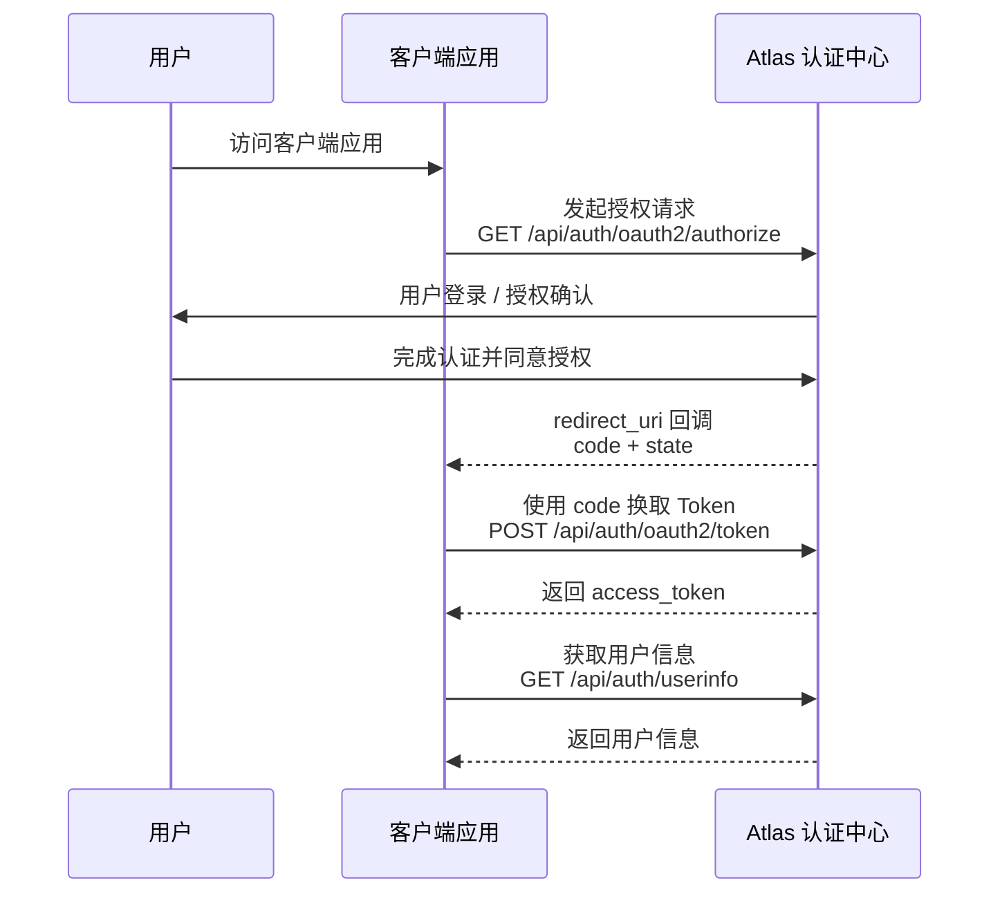

# 授权码模式 (Authorization Code)

授权码模式是 OAuth 2.0 中最安全、最常用的认证授权模式，适用于拥有后端服务器的应用（如 Web 应用或服务端的移动应用代理）。

## 授权流程概览

授权码模式整体流程如下：



---

## 1. 获取授权码

### 1.1. 接口请求信息

* **请求地址**: `/api/auth/oauth2/authorize`
* **请求方式**: `GET`
* **接口说明**: 引导客户端发起授权请求。系统会校验当前用户的登录状态与请求参数。

---

### 1.2. 请求头 (Headers)

| 参数名 | 类型 | 必填 | 说明 |
| :--- | :--- | :--- | :--- |
| `Authorization` | string | 否 | **用户会话凭证**。格式为 `Bearer <Access Token>`。 |

> **💡 登录状态说明**：
> * 如果请求时**未携带** `Authorization` 请求头，或者携带的 Token 已失效/不存在，系统会自动拦截并**重定向至登录页**，引导用户完成身份认证。
> * 用户登录成功后，将自动携带该 Token 重新回到授权流程。

---

### 1.3. 请求参数 (Query Parameters)

| 参数名 | 类型 | 必填 | 说明 |
| :--- | :--- | :--- | :--- |
| `client_id` | string | 是 | 客户端唯一标识（由 Atlas 开放平台分配）。 |
| `response_type` | string | 是 | 响应类型。授权码模式下固定为 **`code`**。 |
| `scope` | string | 是 | 权限范围。多个权限之间使用空格分隔（也支持 `+` 编码形式）。不同 scope 决定客户端可访问的资源范围。 |
| `redirect_uri` | string | 是 | 授权成功后的回调地址。必须与应用注册时登记的白名单地址一致（需进行 URL 编码）。 |
| `state` | string | 否 | 客户端维护的状态码。服务端会在回调时原封不动地返回，用于防御 CSRF 攻击。**强烈推荐传入** |
| `prompt` | string | 否 | 交互提示策略。例如设置为 `consent` 时，会强制弹出授权确认页，要求用户手动确认授权。 |
| `code_challenge` | string | 否 | PKCE 参数。客户端生成随机 `code_verifier` 后，通过指定算法计算得到的挑战值。授权成功后，服务端会基于该值绑定授权码，防止授权码被截获后被恶意兑换。**强烈推荐传入。** |
| `code_challenge_method` | string | 否 | PKCE 挑战值计算方式。推荐使用 **`S256`**，表示使用 SHA-256 算法计算 `code_challenge`。**强烈推荐传入** |

> **🔐 PKCE 安全要求**
>
> Atlas 强烈建议所有客户端接入授权码模式时启用 PKCE（Proof Key for Code Exchange）。
>
> PKCE 详细机制、参数说明以及 Token 兑换流程请参考：
>
> [PKCE 安全机制说明](/docs/oauth2/concepts/pkce)

---

### 1.4. 调试示例 (cURL)

```bash
curl --location --request GET 'https://atlas.sample.xx/api/auth/oauth2/authorize' \
  --header 'Authorization: Bearer xxx' \
  --data-urlencode 'client_id=xxxx' \
  --data-urlencode 'response_type=code' \
  --data-urlencode 'scope=profile openid' \
  --data-urlencode 'redirect_uri=https://client.sample.xx/oauth2/callback/atlas' \
  --data-urlencode 'state=xxxx' \
  --data-urlencode 'prompt=consent' \
  --data-urlencode 'code_challenge=xxxxxxxxxxxxxxxx' \
  --data-urlencode 'code_challenge_method=S256'
```

---

### 1.5 授权响应说明

授权接口不会直接返回 Access Token，而是通过浏览器重定向（HTTP 302 Redirect）的方式完成授权流程。

根据用户登录状态、授权策略以及用户操作结果，可能存在以下几种响应情况。

---

#### 1.5.1 跳转登录页

当请求未携带有效的用户登录凭证时：

- 未携带 `Authorization` 请求头
- Token 已过期
- Token 不存在或无效

系统会将用户重定向至登录页面。

用户完成登录后，系统会自动恢复原授权流程。

---

#### 1.5.2 跳转授权确认页

当请求参数中指定：

```text
prompt=consent
```

系统会跳转至授权确认页面。

用户需要在授权页面确认是否允许客户端访问申请的权限。

授权页面通常包含：

- 应用名称
- 应用描述
- 请求授权的权限范围（scope）
- 用户确认 / 拒绝操作

---

#### 1.5.3 授权成功响应

用户确认授权后，系统会将浏览器重定向至客户端注册的 `redirect_uri`，并携带授权码。

响应示例：

```http
HTTP/1.1 302 Found
Location: https://client.sample.xx/oauth2/callback/atlas?code=xxxxxx&state=xxxx
```

客户端收到的回调地址：

```text
https://client.sample.xx/oauth2/callback/atlas?code=xxxxxx&state=xxxx
```

回调参数说明：

| 参数名 | 类型 | 必填 | 说明 |
| :--- | :--- | :- | :--- |
| `code` | string | 是 | 授权码，用于后续调用 Token 接口兑换 Access Token。授权码具有有效期限制，并且只能使用一次。 |
| `state` | string | 否 | 原样返回客户端请求中的状态值，用于客户端校验请求合法性，防止 CSRF 攻击。 |

> 注意：
>
> - 客户端收到 `code` 后，应立即调用 Token 接口完成兑换。
> - `code` 只能使用一次，兑换成功后立即失效。
> - 客户端必须校验返回的 `state` 是否与发起授权请求时一致。

---

#### 1.5.4 用户拒绝授权

如果用户在授权确认页面点击拒绝，系统不会返回授权码，而是重定向至客户端 `redirect_uri`，并携带错误信息。

响应示例：

```http
HTTP/1.1 302 Found
Location: https://client.sample.xx/oauth2/callback/atlas?error=access_denied&state=xxxx
```

回调参数说明：

| 参数名 | 类型 | 必填 | 说明 |
| :--- | :--- | :- | :--- |
| `error` | string | 是 | OAuth2 错误码，例如 `access_denied`。 |
| `state` | string | 否 | 原请求携带的状态值。 |

---

#### 1.5.5 授权请求失败

当请求参数校验失败时，例如：

- `client_id` 不存在
- `redirect_uri` 未注册或不匹配
- `scope` 不支持
- 缺少必填参数

系统会直接返回错误响应。

响应示例：

```json
{
  "error": "invalid_request",
  "error_description": "Missing required parameter: client_id"
}
```

错误码说明：

| 错误码 | 说明 |
| :--- | :--- |
| `invalid_request` | 请求参数缺失或格式错误。 |
| `invalid_client` | 客户端身份校验失败。 |
| `invalid_redirect_uri` | 回调地址未注册或不匹配。 |
| `invalid_scope` | 请求权限范围不存在或不支持。 |
| `access_denied` | 用户拒绝授权。 |


---

## 2. 获取 Access Token

客户端获取授权码（code）后，需要调用 Token 接口兑换 Access Token。