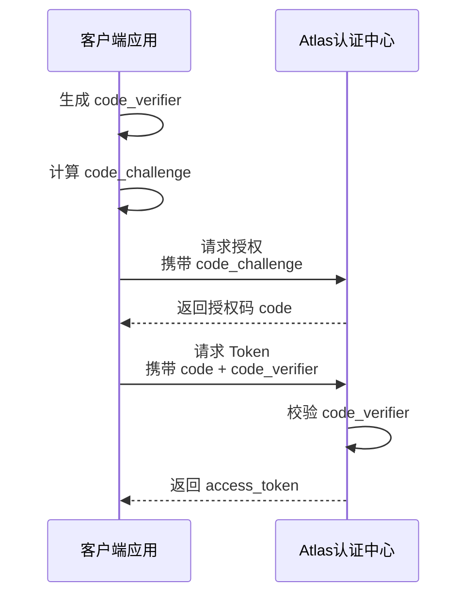

# PKCE 安全机制说明

PKCE（Proof Key for Code Exchange，授权码交换证明）是 OAuth 2.0 授权码模式的安全增强机制，用于防止授权码被截获后被恶意兑换 Access Token。

Atlas 认证中心强烈建议所有客户端接入授权码模式时启用 PKCE。

---

## 1. 为什么需要 PKCE

传统 OAuth2 授权码模式流程：

```text
客户端
  |
  | GET /api/auth/oauth2/authorize
  |
  v
Atlas 认证中心
  |
  | 返回授权码 code
  |
  v
redirect_uri?code=xxxx
```

客户端随后使用授权码兑换 Access Token：

```text
客户端
  |
  | POST /api/auth/oauth2/token
  | code=xxxx
  |
  v
Atlas 认证中心
  |
  v
access_token
```

如果授权码在浏览器跳转过程中被截获，攻击者可能尝试使用该授权码兑换 Access Token。

PKCE 通过增加 `code_verifier` 校验机制，确保：

> 即使授权码泄露，没有客户端生成的原始 `code_verifier`，也无法兑换 Access Token。

---

## 2. PKCE 流程概览



---

## 3. PKCE 参数说明

| 参数 | 类型 | 必填 | 说明 |
| --- | --- | --- | --- |
| `code_verifier` | string | 是 | 客户端生成的随机字符串，用于 Token 阶段证明客户端拥有授权请求发起者身份。 |
| `code_challenge` | string | 是 | 根据 `code_verifier` 计算得到的挑战值，在授权请求阶段发送给 Atlas。 |
| `code_challenge_method` | string | 是 | `code_challenge` 计算方式，推荐使用 `S256`。 |

---

## 4. code_verifier 生成规则

客户端必须生成随机高强度字符串作为 `code_verifier`。

要求：

- 长度 43 ~ 128 个字符
- 每次授权请求重新生成
- 安全保存直到 Token 兑换完成
- 不允许通过 URL 传输

允许字符：

```text
A-Z
a-z
0-9
-
.
_
~
```

示例：

```text
dBjftJeZ4CVP-mB92K27uhbUJU1p1r_wW1gFWFOEjXk
```

---

## 5. code_challenge 计算方式

Atlas 推荐：

```text
code_challenge_method=S256
```

计算：

```text
code_challenge = BASE64URL(SHA256(code_verifier))
```

---

## 6. 授权请求示例

```http
GET /api/auth/oauth2/authorize
```

请求参数：

```text
...
code_challenge=xxxxxxxx
code_challenge_method=S256
```

---

## 7. Token 兑换示例

```http
POST /api/auth/oauth2/token
Content-Type: application/x-www-form-urlencoded
```

请求参数：

```text
grant_type=authorization_code
client_id=xxxx
code=xxxx
redirect_uri=https://client.sample.xx/oauth2/callback/atlas
code_verifier=xxxxxxxx
```

---

## 8. 安全要求

Atlas 认证中心要求：

- 所有客户端推荐启用 PKCE
- `code_challenge_method` 必须使用 `S256`
- 不推荐使用 `plain`
- `code_verifier` 必须由客户端生成并保存
- `code_verifier` 不得暴露在日志或 URL 中

---

## 9. 常见错误

| 错误码 | 说明 |
| --- | --- |
| `invalid_request` | 缺少 PKCE 必填参数。 |
| `invalid_grant` | `code_verifier` 校验失败。 |
| `unsupported_challenge_method` | 不支持的挑战算法。 |

---

## 10. 推荐配置

Atlas 推荐 OAuth2 授权码模式：

```text
response_type=code
code_challenge_method=S256
```