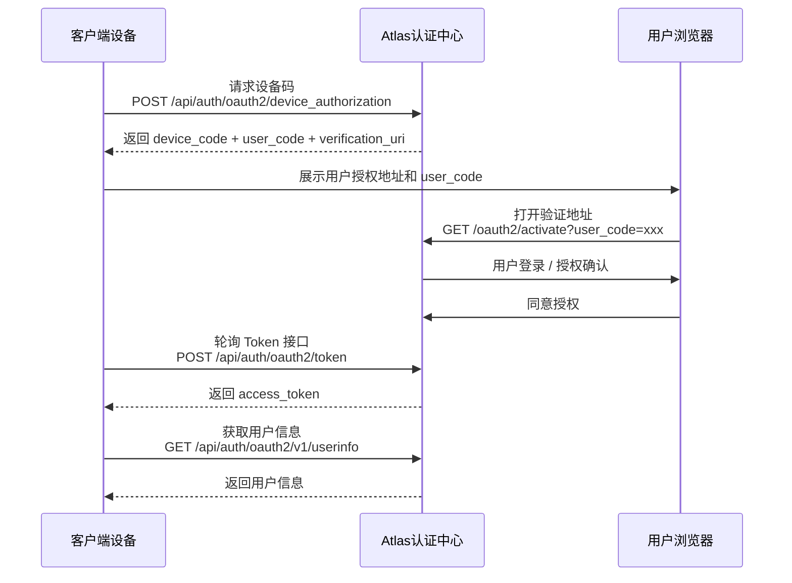

# 设备码模式 (Device Authorization Grant)

设备码模式是 OAuth 2.0 定义的一种授权模式，主要用于**输入能力有限或无法直接打开浏览器完成授权的设备**，例如：

- 智能终端设备
- CLI 命令行工具
- IoT 设备
- 无浏览器环境的应用

该模式通过设备生成一个临时 `device_code` 和用户可输入的 `user_code`，用户在其他设备（通常是浏览器）完成登录和授权，客户端随后通过轮询 Token 接口获取 Access Token。

---

## 授权流程概览

设备码模式整体流程如下：



---

## 1. 获取设备码

客户端设备首先需要向 Atlas 请求设备授权码。

该接口用于生成：

- `device_code`
  - 客户端轮询 Token 时使用
  - 不展示给用户

- `user_code`
  - 用户在浏览器授权页面输入
  - 展示给用户

---

### 1.1 接口请求信息

* **请求地址**: `/api/auth/oauth2/device_authorization`
* **请求方式**: `POST`
* **接口说明**: 创建设备授权请求，并返回设备码相关信息。

---

### 1.2 请求参数 (Form Parameters)

| 参数名 | 类型 | 必填 | 说明 |
| :--- | :--- | :--- | :--- |
| `client_id` | string | 是 | OAuth2 客户端唯一标识。 |
| `client_secret` | string | 是 | OAuth2 客户端密钥，用于客户端身份认证。 |
| `scope` | string | 是 | 权限范围。多个权限之间使用空格分隔（也支持 `+` 编码形式）。不同 scope 决定客户端可访问的资源范围。详细说明请参考 [Scope 权限范围说明](/docs/oauth2/concepts/scope)。 |

---

### 1.3 请求头 (Headers)

| 参数名 | 类型 | 必填 | 说明 |
| :--- | :--- | :- | :--- |
| `Content-Type` | string | 是 | 请求内容类型。固定为 `application/x-www-form-urlencoded`。 |

---

### 1.4 调用示例(cURL)

```bash
curl --location --request POST \
'https://atlas.sample.xx/api/auth/oauth2/device_authorization' \
--header 'Content-Type: application/x-www-form-urlencoded' \
--data-urlencode 'client_id=xxxx' \
--data-urlencode 'client_secret=xxxx' \
--data-urlencode 'scope=profile'
```
---

### 1.5 响应说明

响应示例：

```json
{
    "user_code": "FLSL-SSNW",
    "device_code": "izutTy-WtTdKfQgbe3l70TqBsFTQtXbuqFEfrq1kcPOkWJTiJ46FVMjuUOguTIVObK-DQuTrKmZumiq2oSO2oZk31nTyHegG0pVlqXEWLQ_-hIjRWPSIm4rU7sGH2PVl",
    "verification_uri_complete": "https://atlas.sample.com/oauth2/activate?user_code=FLSL-SSNW",
    "verification_uri": "https://atlas.sample.com/oauth2/activate",
    "expires_in": 300
}
```

| 参数名 | 类型 | 说明 |
| :--- | :--- | :--- |
| `device_code` | string | 设备授权码，用于后续 Token 请求。客户端需要保存，不展示给用户。 |
| `user_code` | string | 用户验证码，需要展示给用户。 |
| `verification_uri` | string | 用户授权验证地址。 |
| `verification_uri_complete` | string | 包含 user_code 的完整授权地址，可直接打开。 |
| `expires_in` | number | 设备码有效时间，单位：秒。 |

---

## 2. 设备码校验

用户需要在浏览器中打开设备授权验证地址，用于绑定当前设备授权请求。

该接口主要用于：

- 校验客户端生成的 `user_code` 是否有效。
- 查询对应的设备授权请求。
- 获取当前设备申请的 Scope 信息。
- 引导用户完成登录认证。
- 进入用户授权确认流程。

---

### 2.1 接口请求信息

- **请求地址**: `/api/auth/oauth2/device_verification?user_code=xxx`
- **请求方式**: `GET`
- **接口说明**: 根据用户输入的 `user_code` 查询设备授权请求，如果当前用户未登录，Atlas 会引导用户完成登录认证,如果当前用户已登录，则直接进入授权确认页面。

---

### 2.2. 请求头 (Headers)

| 参数名 | 类型 | 必填 | 说明 |
| :--- | :--- | :--- | :--- |
| `Authorization` | string | 否 | **用户会话凭证**。格式为 `Bearer <Access Token>`。 |

> **💡 登录状态说明**：
> * 如果请求时**未携带** `Authorization` 请求头，或者携带的 Token 已失效/不存在，系统会自动拦截并**重定向至登录页**，引导用户完成身份认证。
> * 用户登录成功后，将自动携带该 Token 重新回到授权流程。

---

### 2.3 请求参数

| 参数名 | 类型 | 必填 | 说明 |
| :--- | :--- | :--- | :--- |
| `user_code` | string | 是 | 用户设备展示的验证码。 |

---

## 3. 同意授权

用户完成身份认证并确认授权后，需要调用设备授权确认接口。

该接口用于：

- 获取当前已认证用户的授权确认结果。
- 更新设备授权请求状态。
- 允许客户端后续通过 `device_code` 轮询 Token 接口获取 Access Token。

> 注意：该接口由用户授权页面调用，不是客户端设备直接调用。

---

### 3.1 接口请求信息

* **请求地址**: `/api/auth/oauth2/device_verification`
* **请求方式**: `POST`
* **接口说明**: 用户在授权确认页面点击同意后，由 Atlas 完成设备授权确认。

---

### 3.2 请求头

| 请求头 | 是否必填 | 说明 |
| :--- | :--- | :--- |
| `Authorization` | 是 | 当前登录用户的身份凭证，用于确认授权用户身份。格式：`Bearer {access_token}`。 |
| `Content-Type` | 是 | 固定值：`application/x-www-form-urlencoded`。 |

---

### 3.3 请求参数

| 参数名 | 类型 | 必填 | 说明 |
| :--- | :--- | :--- | :--- |
| `client_id` | string | 是 | OAuth2 客户端唯一标识。 |
| `user_code` | string | 是 | 获取设备码接口返回的用户验证码，用于定位当前设备授权请求。 |
| `scope` | string | 是 | 用户最终确认授权的权限范围，多个 Scope 使用空格分隔。[Scope 权限范围说明](/docs/oauth2/concepts/scope) |
| `state` | string | 否 | 防止请求伪造的状态参数，用于保持请求上下文。 |

---

### 3.4 调用示例(cURL)

```bash
curl --location --request POST \
'{{host}}/api/auth/oauth2/device_verification' \
--header 'Authorization: Bearer xxx' \
--header 'Content-Type: application/x-www-form-urlencoded' \
--data-urlencode 'client_id=xxxx' \
--data-urlencode 'user_code=WDJB-MJHT' \
--data-urlencode 'scope=profile' \
--data-urlencode 'state=abc123'
```

---

### 3.5 授权结果

授权成功后：

- 设备授权状态变更为已批准。
- 客户端后续轮询 Token 接口时，可以获取 Access Token。

如果用户拒绝授权：

- 授权状态变更为拒绝。
- 客户端轮询 Token 接口会收到：

```json
{
  "error": "access_denied"
}
```

---

## 4. 获取 Access Token

客户端获取 `device_code` 后，需要持续轮询 Token 接口。

当：

- 用户尚未完成授权

返回：

```json
{
  "error": "authorization_pending"
}
```

当：

- 用户完成授权

返回 Access Token。

---

### 4.1 接口请求信息

- **请求地址**: `/api/auth/oauth2/token`
- **请求方式**: `POST`
- **接口说明**: 客户端通过获取的 `device_code` 持续的持续轮询 Token 接口。

---

### 4.2 请求参数

| 参数名 | 类型 | 必填 | 说明 |
| :--- | :--- | :--- | :--- |
| `client_id` | string | 是 | 客户端唯一标识。 |
| `client_secret` | string | 是 | OAuth2 客户端密钥，用于客户端身份认证。 |
| `grant_type` | string | 是 | 固定值：`urn:ietf:params:oauth:grant-type:device_code` |
| `device_code` | string | 是 | 获取设备码接口返回的 device_code。 |


---

### 4.3 调用示例(cURL)

```bash
curl --location --request POST \
'https://atlas.sample.xx/api/auth/oauth2/token' \
--header 'Content-Type: application/x-www-form-urlencoded' \
--data-urlencode 'client_id=xxxx'
--data-urlencode 'client_secret=xxxx'
--data-urlencode 'grant_type=urn:ietf:params:oauth:grant-type:device_code' \
--data-urlencode 'device_code=izutTy-WtTdKfQgbe3l70TqBsFTQtXbuqFEfrq1kcPOkWJTiJ46FVMjuUOguTIVObK-DQuTrKmZumiq2oSO2oZk31nTyHegG0pVlqXEWLQ_-hIjRWPSIm4rU7sGH2PVl'
```

---

### 4.4 响应说明

响应示例：

```json
{
  "access_token": "eyJxxxx",
  "refresh_token": "eyJxxxx",
  "token_type": "token",
  "expires_in": 3600,
  "scope": "openid profile"
}
```

字段说明：

| 参数名 | 类型 | 说明 |
| :--- | :--- | :--- |
| `access_token` | string | 访问令牌，用于调用资源接口。 |
| `refresh_token` | string | 刷新 Token 使用。 |
| `token_type` | string | Token 类型，固定为 token |
| `expires_in` | number | Access Token 有效时间，单位：秒。 |
| `scope` | string | 最终授权范围。 |

---