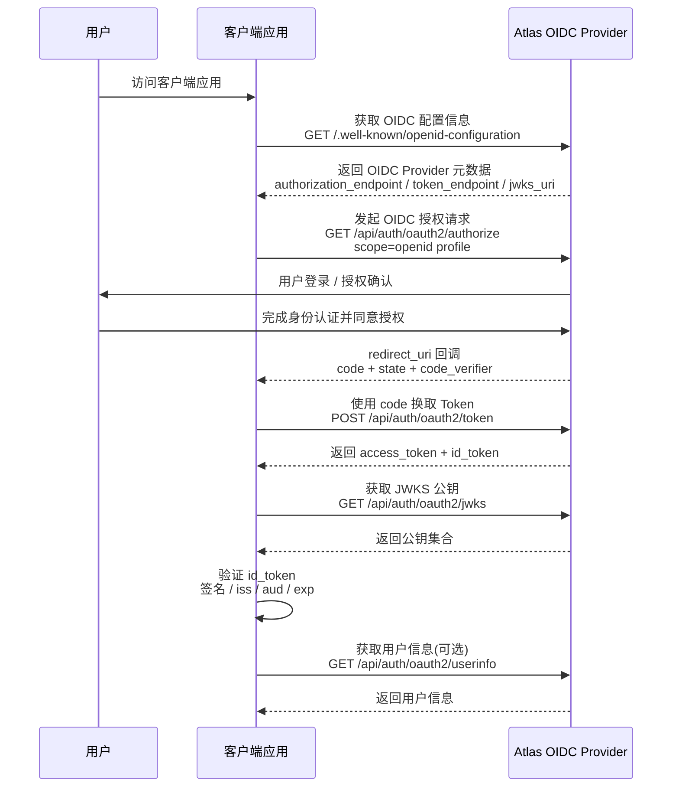

# OIDC 认证 (OpenID Connect)

OpenID Connect（OIDC）是基于 OAuth2 扩展的身份认证协议。在 OAuth2 授权能力基础上提供用户身份认证能力。



通过 OIDC：

- 客户端可以完成用户身份认证。
- 客户端可以获取用户身份信息。
- 客户端可以通过 ID Token 验证用户身份。

Atlas 支持基于以下标准能力：

- OpenID Connect Discovery
- ID Token（JWT）
- JWKS 公钥验证
- UserInfo Endpoint

---


## 1. OIDC 服务发现

OIDC 客户端无需手动配置授权地址、Token 地址、公钥地址等信息。

客户端只需要访问 Atlas 提供的 Discovery Endpoint：

```
GET /api/auth/.well-known/openid-configuration
```

Atlas 返回 OIDC Provider 元数据。

客户端可以根据返回内容自动获取：

- OAuth2 Authorization Endpoint
- Token Endpoint
- UserInfo Endpoint
- JWKS Endpoint
- 支持的 Scope
- 支持的 Response Type
- 支持的加密算法


---

## 2. 获取 OIDC 配置信息

### 2.1 接口请求信息

- **请求地址**: `/api/auth/.well-known/openid-configuration`
- **请求方式**: `GET`
- **接口说明**: 获取 Atlas OIDC Provider 配置信息。

---

### 2.2 调用示例

```bash
curl --location 'https://atlas.ys0921.sbs:4443/api/auth/.well-known/openid-configuration'
```

---

### 2.3 响应说明

响应示例

```json
{
    "issuer": "https://atlas.ys0921.sbs:4443/api/auth",
    "authorization_endpoint": "https://atlas.ys0921.sbs:4443/api/auth/oauth2/authorize",
    "device_authorization_endpoint": "https://atlas.ys0921.sbs:4443/api/auth/oauth2/device_authorization",
    "token_endpoint": "https://atlas.ys0921.sbs:4443/api/auth/oauth2/token",
    "token_endpoint_auth_methods_supported": [
        "client_secret_basic",
        "client_secret_post",
        "client_secret_jwt",
        "private_key_jwt",
        "tls_client_auth",
        "self_signed_tls_client_auth"
    ],
    "jwks_uri": "https://atlas.ys0921.sbs:4443/api/auth/oauth2/jwks",
    "userinfo_endpoint": "https://atlas.ys0921.sbs:4443/api/auth/userinfo",
    "response_types_supported": [
        "code"
    ],
    "grant_types_supported": [
        "authorization_code",
        "client_credentials",
        "refresh_token",
        "urn:ietf:params:oauth:grant-type:device_code",
        "urn:ietf:params:oauth:grant-type:token-exchange"
    ],
    "code_challenge_methods_supported": [
        "S256"
    ],
    "id_token_signing_alg_values_supported": [
        "RS256"
    ],
    "scopes_supported": [
        "openid",
        "profile",
        "email",
        "phone"
    ]
}
```

字段说明：

| 字段 | 类型 | 说明 |
| :--- | :--- | :--- |
| `issuer` | string | OIDC 服务唯一标识。必须与 ID Token 中的 `iss` 字段一致。 |
| `authorization_endpoint` | string | OAuth2 授权地址。用于发起授权请求。 |
| `device_authorization_endpoint` | string | OAuth2 设备码端点。 |
| `token_endpoint` | string | Token 获取地址。用于使用授权码交换 Token。 |
| `userinfo_endpoint` | string | 用户信息接口地址。 |
| `jwks_uri` | string | JWKS 公钥地址。客户端用于验证 ID Token 签名。 |
| `scopes_supported` | array | 支持的 Scope 列表。 |
| `response_types_supported` | array | 支持的 OAuth2 response_type。 |
| `id_token_signing_alg_values_supported` | array | ID Token 支持的签名算法。 |


---

## 3. 获取 JWKS 公钥

OIDC 使用 JWT 格式的 ID Token。

客户端收到 ID Token 后，需要通过 Atlas 提供的 JWKS Endpoint 获取公钥，并验证 JWT 签名。

### 2.1 接口请求信息

- **请求地址**: `/api/auth/oauth2/jwks`
- **请求方式**: `GET`
- **接口说明**: 获取 Atlas JWT 签名公钥集合。

---

### 3.2 调用示例

```bash
curl --location 'https://atlas.ys0921.sbs:4443/api/auth/oauth2/jwks'
```

---

### 3.3 响应说明

响应示例

```json
{
    "keys": [
        {
            "kty": "RSA",
            "e": "AQAB",
            "kid": "808b844c8b265249af94508bcecebdf0",
            "n": "xxx"
        }
    ]
}
```

字段说明：

| 字段 | 类型 | 说明 |
| :--- | :--- | :--- |
| `kid` | string | 密钥唯一标识，与 JWT Header 中的 kid 对应。 |
| `kty` | string | 密钥类型。 |
| `alg` | string | 签名算法。 |
| `n` | string | RSA 公钥模数。 |
| `e` | string | RSA 公钥指数。 |


## 4. OIDC 登录流程

OIDC 登录流程基于 OAuth2 授权码模式扩展。

流程如下：

```
客户端
  |
  | 1. 发起授权请求
  ↓
Atlas Authorization Endpoint
  |
  | 2. 用户认证授权
  ↓
Atlas
  |
  | 3. 返回 code
  ↓
客户端
  |
  | 4. code 换 Token
  ↓
Atlas Token Endpoint
  |
  | 返回 access_token + id_token
  ↓
客户端
  |
  | 5. 验证 id_token
  ↓
获取用户身份
```

---

## 5. ID Token 验证

客户端收到 `id_token` 后，需要验证：

| 校验项 | 说明 |
| :--- | :--- |
| 签名 | 使用 JWKS Endpoint 获取公钥验证 JWT 签名。 |
| iss | 校验发行者是否等于 Discovery 返回的 issuer。 |
| aud | 校验是否包含当前 client_id。 |
| exp | 校验 Token 是否过期。 |
| nonce | 如果请求携带 nonce，需要校验一致性。 |

验证成功后，客户端可以信任 ID Token 中的用户身份信息。
