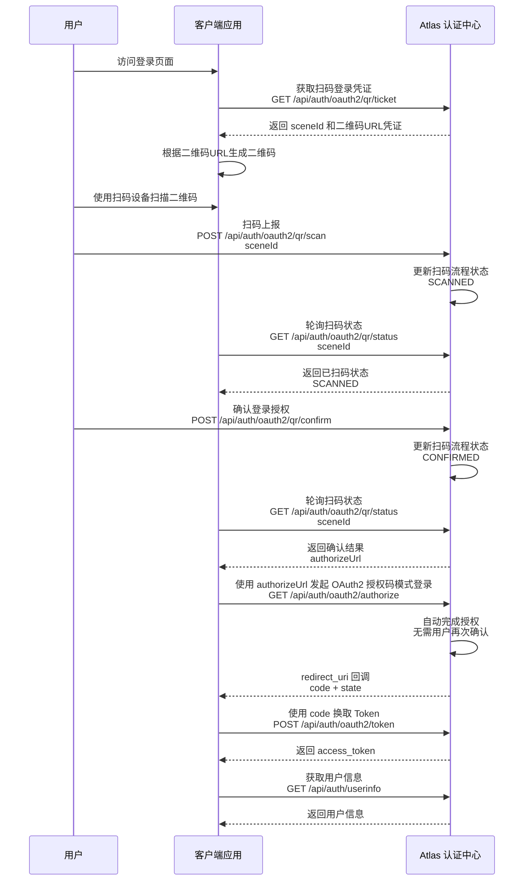

# 扫码登录模式 (QR Code Login)

扫码登录通常基于 OAuth 2.0 授权码模式进行扩展。它通过移动端扫码来替代 PC 端的直接账号密码输入，既提升了用户体验，又保证了安全性。

## 扫码登录流程概览

扫码登录整体流程包含 获取凭证、轮询状态、扫码确认、OAuth2 授权 四个阶段，具体时序如下：



---

## 1. 获取扫码凭证

### 1.1 接口说明

> ✅ 客户端调用接口
客户端访问登录页面时，需要首先调用该接口创建一次扫码登录会话。

Atlas 会完成以下操作：

- 校验 OAuth2 客户端是否合法。
- 校验 `redirect_uri` 是否属于客户端注册地址。
- 校验请求的 `scope` 是否在客户端授权范围内。
- 创建唯一扫码场景 `scene_id`。
- 保存本次扫码登录上下文。
- 返回二维码生成地址 `qr_url`。

客户端获取 `qr_url` 后，可根据该地址生成二维码展示给用户。

---

### 1.2 接口请求信息

* **请求地址**: `/api/auth/oauth2/qr/ticket`
* **请求方式**: `GET`
* **接口说明**: 创建扫码登录授权请求，并返回二维码相关信息。

---

#### 请求参数 (Query Parameters)

| 参数名 | 类型 | 必填 | 说明 |
| :--- | :--- | :--- | :--- |
| `client_id` | string | 是 | OAuth2 客户端唯一标识。 |
| `redirect_uri` | string | 是 | OAuth2 授权完成后的回调地址。必须属于客户端注册的 Redirect URI 列表。 |
| `scope` | string | 是 | 权限范围。多个权限之间使用空格分隔（也支持 `+` 编码形式）。不同 scope 决定客户端可访问的资源范围。详细说明请参考 [Scope 权限范围说明](/docs/oauth2/concepts/scope)。 |
| `state` | string | 否 | 客户端生成并维护的随机状态值。Atlas 会在授权完成后的回调请求中原样返回该参数，客户端应校验返回值是否与发起授权请求时一致，用于防止 CSRF（跨站请求伪造）攻击。**强烈推荐传入。** |
| `code_challenge` | string | 否 | PKCE 参数。客户端生成随机 `code_verifier` 后，通过指定算法计算得到的挑战值。授权成功后，服务端会基于该值绑定授权码，防止授权码被截获后被恶意兑换。**强烈推荐传入。** |
| `code_challenge_method` | string | 否 | PKCE 挑战值计算方式。推荐使用 **`S256`**，表示使用 SHA-256 算法计算 `code_challenge`。**强烈推荐传入** |

> **🔐 PKCE 安全要求**
>
> Atlas 强烈建议所有客户端接入扫码登录模式时启用 PKCE（Proof Key for Code Exchange）。
>
> PKCE 详细机制、参数说明以及 Token 兑换流程请参考：
>
> [PKCE 安全机制说明](/docs/oauth2/concepts/pkce)

---

### 1.3 调试示例 (cURL)

```bash
curl --location --request GET 'https://atlas.ys0921.sbs:4443/api/auth/oauth2/qr/ticket' \
  --data-urlencode 'client_id=xxxx' \
  --data-urlencode 'redirect_uri=https://client.sample.xx/oauth2/callback/atlas' \
  --data-urlencode 'scope=profile openid' \
  --data-urlencode 'state=xxxx' \
  --data-urlencode 'code_challenge=xxxxxxxxxxxxxxxx' \
  --data-urlencode 'code_challenge_method=S256'
```

---

### 1.4 响应说明

响应示例：

```json
{
    "sceneId": "8f3b7f9a6c5e4d3a2b1c0e9f8a7b6c5d",
    "qrUrl": "https://atlas.ys0921.sbs:4443/oauth2/qr/scan?scene_id=8f3b7f9a6c5e4d3a2b1c0e9f8a7b6c5d",
    "expireSeconds": 300
}
```

字段说明：

| 参数名 | 类型 | 说明 |
| :--- | :--- | :--- |
| `sceneId` | string | 扫码登录场景唯一标识。客户端后续轮询扫码状态时使用。 |
| `qrUrl` | string | 二维码内容地址。客户端需要根据该地址生成二维码展示给用户。 |
| `expireSeconds` | number | 二维码有效时间，单位：秒。 |

---

## 2. 扫码上报

### 2.1 接口说明

> 🔒 Atlas 扫码流程接口  
>
> 该接口由用户扫码后的扫码端调用，用于通知 Atlas 当前二维码已经被扫描。

当用户使用扫码设备扫描二维码后，扫码端会解析二维码中的 `sceneId`，并调用该接口通知 Atlas 更新当前扫码登录状态。

接口调用成功后：

```
PENDING → SCANNED
```

表示：

- 二维码有效。
- 用户已经完成扫码。
- 等待用户后续确认登录授权。

> 注意：
>
> - 第三方客户端无需调用该接口。
> - 该接口只表示“用户已扫码”，不代表用户已经登录成功。
> - 用户确认授权后，还需要继续调用确认授权流程。

---

### 2.2 接口请求信息

* **请求地址**: `/api/auth/oauth2/qr/scan`
* **请求方式**: `POST`
* **接口说明**: 用户扫码后，上报扫码事件并更新扫码登录状态。

请求参数 (Query Parameters)

| 参数名 | 类型 | 必填 | 说明 |
| :--- | :--- | :--- | :--- |
| `sceneId` | string | 是 | 扫码登录场景唯一标识。由获取扫码登录凭证接口返回。 |

---

### 2.3 调用示例(cURL)

```bash
curl --location --request GET 'https://atlas.ys0921.sbs:4443/api/auth/oauth2/qr/scan' \
  --data-urlencode 'sceneId=xxx' \
```

### 2.4 响应说明

响应示例：

```json
{
    "code": 200,
    "message": "success",
    "data": null
}
```

---

## 3. 扫码确认

### 3.1 接口说明

> 👤 用户授权流程接口
>
> 该接口由用户扫码后的授权页面调用，不由客户端应用直接调用。

用户扫码成功后，Atlas 会进入登录确认阶段。

用户需要在授权页面确认是否允许当前客户端登录：

- 用户确认登录：
  - Atlas 更新扫码状态。
  - 生成 OAuth2 授权地址 `authorizeUrl`。
  - 客户端后续通过状态查询接口获取该地址，并继续完成 OAuth2 授权码流程。

- 用户未确认：
  - 当前扫码流程保持等待状态。

---

### 3.2 接口请求信息

* **请求地址**: `/api/auth/oauth2/qr/confirm`
* **请求方式**: `POST`
* **接口说明**: 用户确认扫码登录授权后，更新扫码授权状态，并生成后续 OAuth2 授权地址。

---

#### 请求头 (Headers)

| 参数名 | 类型 | 必填 | 说明 |
| :--- | :--- | :--- | :--- |
| `Authorization` | string | 是 | 当前登录用户身份凭证。格式：`Bearer <Access Token>`。用于确认授权用户身份。 |

---

#### 请求参数 (Query Parameters)

| 参数名 | 类型 | 必填 | 说明 |
| :--- | :--- | :--- | :--- |
| `sceneId` | string | 是 | 扫码登录场景唯一标识。由获取扫码登录凭证接口 `/api/auth/oauth2/qr/ticket` 返回。 |

---

### 3.3 调用示例(cURL)

```bash
curl --location --request GET 'https://atlas.ys0921.sbs:4443/api/auth/oauth2/qr/confirm' \
  --header 'Authorization: Bearer xxx' \
  --data-urlencode 'sceneId=xxx' \
```

---

### 3.4 响应说明

确认成功：

```json
{
    "code": 200,
    "message": "success",
    "data": null
}
```

---

## 4. 获取扫码状态

### 4.1 接口说明

> ✅ 客户端调用接口
>
> 客户端在展示二维码后，需要通过该接口持续轮询当前扫码登录状态。

该接口用于查询当前 `sceneId` 对应的扫码登录流程状态。

客户端根据返回状态判断用户当前操作进度：

- 用户未扫码时，继续等待。
- 用户扫码后，状态变更为 `SCANNED`。
- 用户确认授权后，返回 `CONFIRMED` 状态，并携带 OAuth2 授权地址 `authorizeUrl`。
- 二维码过期后，返回 `EXPIRED` 状态。

--

### 4.2 接口请求信息

* **请求地址**: `/api/auth/oauth2/qr/status`
* **请求方式**: `GET`
* **接口说明**: 根据扫码场景 ID 查询当前扫码登录状态。

---

#### 请求参数 (Query Parameters)

| 参数名 | 类型 | 必填 | 说明 |
| :--- | :--- | :--- | :--- |
| `sceneId` | string | 是 | 扫码登录场景唯一标识。由获取扫码登录凭证接口 `/api/auth/oauth2/qr/ticket` 返回。 |

---

### 4.3 调用示例(cURL)

```bash
curl --location --request GET 'https://atlas.ys0921.sbs:4443/api/auth/oauth2/qr/status' \
  --data-urlencode 'sceneId=xxx' \
```

---

### 4.4 响应说明

响应示例：

```json
{
    "status": "SCANNED",
    "authorizeUrl": null
}
```

响应说明：

| 参数名 | 类型 | 说明 |
| :--- | :--- | :--- |
| `status` | string | 当前扫码登录状态。 |
| `authorizeUrl` | string | OAuth2 授权地址。仅当用户确认登录授权后返回。 |

---

### 4.5 状态说明

| 状态值 | 说明 | 客户端处理 |
| :--- | :--- | :--- |
| `PENDING` | 等待用户扫码。二维码已生成，尚未被扫描。 | 继续轮询扫码状态接口，等待用户扫码。 |
| `SCANNED` | 用户已扫码，等待用户确认登录授权。 | 继续轮询扫码状态接口，等待用户确认授权。 |
| `CONFIRMED` | 用户已确认授权，客户端可以使用 authorizeUrl 继续完成 OAuth2 授权流程。 | 使用 `authorizeUrl` 发起 OAuth2 授权码流程，获取授权码 `code`，然后调用 Token 接口换取 Access Token。 |
| `EXPIRED` | 二维码已过期或扫码登录会话不存在，需要重新获取二维码。 | 提示用户二维码失效，重新调用 `/api/auth/oauth2/qr/ticket` 获取新的二维码。 |

---

### 4.6 CONFIRMED 状态处理说明

当客户端查询到：

````json
{
    "status": "CONFIRMED",
    "authorizeUrl": "https://atlas.example.com/oauth2/authorize?..."
}
````

表示：

* 用户已经完成扫码。
* 用户已经确认登录授权。
* Atlas 已生成 OAuth2 授权请求地址 authorizeUrl。
* 当前扫码登录流程完成，但 OAuth2 授权码流程尚未结束。

> 注意：
>
> `CONFIRMED` 不代表客户端已经获取 Access Token。
>
> 客户端仍需要继续执行 OAuth2 授权码流程。

---

#### 客户端处理方式
客户端获取 authorizeUrl 后，需要使用浏览器打开该地址。

```javascript title="JavaScript"
window.location.href = authorizeUrl;
```

也可以根据业务场景使用：

```javascript title="JavaScript"
window.open(authorizeUrl);
```

#### 后续 OAuth2 流程参考：[授权码模式](/docs/oauth2/authorization-code)

> 注意：
>
> - `authorizeUrl` 必须使用 Atlas 返回的完整地址，客户端不要自行拼接。
> - `authorizeUrl` 需要通过浏览器上下文访问，不建议服务端直接 HTTP 请求。
> - 获取 CONFIRMED 状态后，客户端应停止轮询扫码状态接口。
> - 扫码登录确认成功后，Atlas 已完成用户授权确认，客户端打开 `authorizeUrl` 时无需用户再次手动确认授权。
> - 扫码登录最终仍通过 OAuth2 授权码模式完成 Token 获取。
